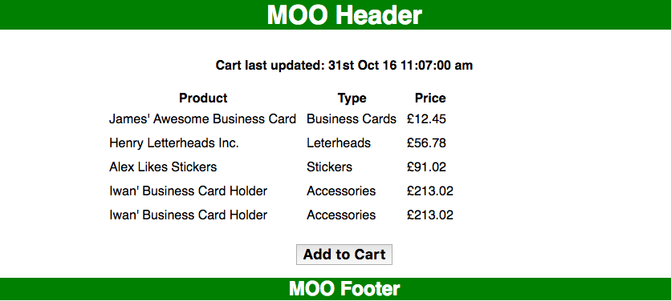

# React Exercise

In this exercise we will be creating a shopping cart in React.

## Prerequisites

To get started, we will need React Create App: https://github.com/facebookincubator/create-react-app

Make sure that you are on Node version 6.9.

To install this and create the environment, type the following commands
```
npm install -g create-react-app

create-react-app react-training-complete
cd react-training-complete/
npm start
```

You should see a page with a React symbol on it. You are now ready to code. I would suggest ripping out and modifying what is there while you build.

## The Challenge

You will need to create a cart. This will look something like this:



This will contain the following:
* Header Component
* Footer Component
* Cart Component
* Current date and time from Moment NPM package
* Add to Cart button that adds to the end of the Cart table.

### What we want to see
* ES2015
* Use of components
* Import and export statements
* State management
* Ability to use external packages
* Events in react
